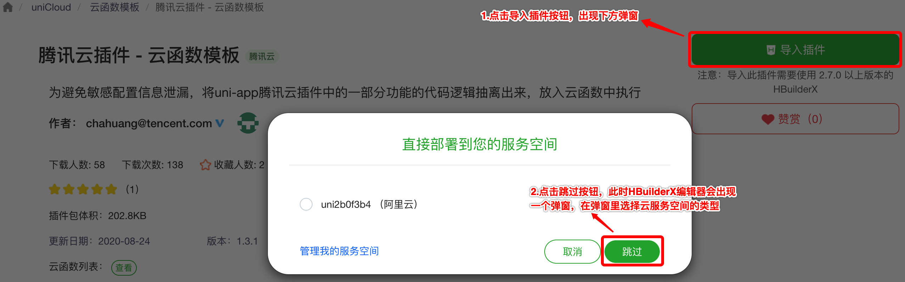
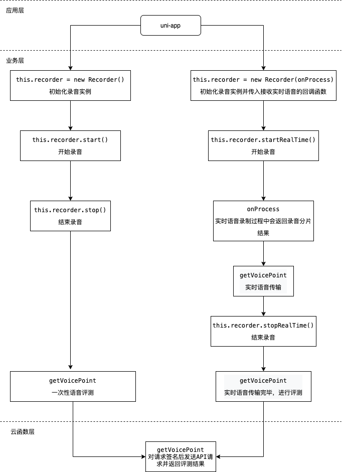

# 腾讯云智聆口语评测（SOE）插件

## 1. 插件介绍
| 标题      | 名称    |
| ----     | ---------------- |
| 中文名称   | 腾讯云智聆口语评测（SOE）插件 |
| 英文名称   | tencentcloud-plugin-soe |
| 最新版本   | v1.0.1 (2020.08.20) |
| 适用平台   | [DCloud uni-app](https://uniapp.dcloud.net.cn) |
| 适用产品   | [腾讯云智聆口语评测（SOE）](https://cloud.tencent.com/product/soe-overview) |
| GitHub项目| [tencentcloud-uniapp-plugin-soe](https://github.com/Tencent-Cloud-Plugins/tencentcloud-uniapp-plugin-soe) |
| 主创团队   | 腾讯云中小企业产品中心（SMB Product Center of Tencent Cloud） |

一款帮助开发者在uni-app项目开发中快捷使用腾讯云智聆口语评测（SOE）产品功能的插件。

## 2. 功能特性

- 口语评测功能，支持语音流式分片评测和非流式一次性评测，方便用户使用腾讯云口语评测功能

## 3. 安装指引

本插件需要调用uniCloud云函数，而使用云函数的前提是：

- 使用DCloud官方开发工具HBuilderX 2.7+；
- 已注册DCloud开发者账号并通过实名认证；
- 开通了uniCloud并创建一个腾讯云的服务空间；

### 3.1. 新建或打开已有项目

1. 打开HBuilderX开发工具；
1. 新建或打开一个uni-app项目；

### 3.2. 导入云函数

1. 访问 DCloud 插件市场的 [腾讯云插件 - 云函数模板](https://ext.dcloud.net.cn/plugin?id=2139) 详情页；
2. 点击详情页右上角 **使用 HBuilderX 导入插件**，将云函数模板导入到您的项目中；

3. 在项目中打开 _cloudfunctions/tencentcloud-plugin/config.js_ 文件，将腾讯云的密钥信息配置进去，可以在腾讯云 [API 密钥管理](https://console.cloud.tencent.com/cam/capi) 中获取 SecretId、SecretKey 和 APPID；

4. 在[uniCloud控制台](https://unicloud.dcloud.net.cn/login)注册HBuild账号并登录，创建[云服务空间](https://uniapp.dcloud.net.cn/uniCloud/concepts/space)；

5. 绑定云函数的云服务空间，将[云函数](https://uniapp.dcloud.net.cn/uniCloud/concepts/cloudfunction) [**上传部署**](https://uniapp.dcloud.net.cn/uniCloud/quickstart?id=rundebug) 到您的[云服务空间](https://uniapp.dcloud.net.cn/uniCloud/concepts/space)；


> 如果您之前在使用其它腾讯云产品的 uni-app 插件时已经导入过此云函数模板，则前 4 个步骤可以省略。

> 若导入失败或有其它疑问，请查看 [uniCloud帮助文档](https://uniapp.dcloud.io/uniCloud/README) 云函数相关章节。

### 3.3. 导入插件

1. 访问DCloud插件市场 [腾讯云智聆口语评测（SOE）插件](https://ext.dcloud.net.cn/plugin?id=2577) 详情页；
2. 点击详情页右上角 **使用HBuilderX导入插件** ，将插件导入到您的项目中；
3. 在项目中通过 import 语法将插件提供的方法导入到相关业务组件并使用；

> 本插件的默认导入位置是在您项目的“js_sdk”目录下

## 4. 使用指引

### 4.1. 插件API导图



### 4.2. 插件API列表

| API名称          | API对应方法名 |
| ---------------- | ------------- |
| 获取语音评测信息 | getVoicePoint |

### 4.3. 插件使用示例

```javascript
// 口语评测（流式分片评测和非流式一次性评测）使用示例
// 从js_sdk列表中导入需要的api
import {
  getVoicePoint,
  randStr,
  Recorder,
  RealTimeVoiceSplit,
} from "@/js_sdk/tencentcloud-plugin-soe";

export default {
  data() {
    return {
      status: false, // 是否开始评测标志
      option: {
        seqId: '', // 分片序号
        serverType: 0, // 中英文标志
        scoreCoeff: 1, // 难度指数
        evalMode: 0, // 评估模式
        sessionId: '', // 语音唯一标识
        workMode: 1, // 语音是否分片传输
      },
      refText: 'tencent', // 评估语言对应的文本
      voiceData: '', // 评估语音 BASE64格式
      recorder: null, // 录音实例
      realTimeVoice: null, // 录音分片实例,
      resultText: '' // 评测分数
    };
  },
  methods: {
    // 流式录音procss
    async onProcess(data, isClose) {
      // #ifdef H5
      const {data: voiceBase64, seq} = await this.realTimeVoice.realTimeSendTryH5(
        this.recorder.rec
      );
      // #endif
      // #ifndef H5
      const {data: voiceBase64, seq} = await this.realTimeVoice.realTimeSendTryMP(data);
      // #endif
      this.option.seqId = seq;

      // 语音评测参数
      let params = {
        sessionId: this.option.sessionId,
        seqId: seq,
        isEnd: isClose ? 1 : 0,
        serverType: Number(this.option.serverType),
        scoreCoeff: Number(this.option.scoreCoeff),
        evalMode: Number(this.option.evalMode),
        workMode: Number(this.option.workMode)
      };
      const { result } = await getVoicePoint(voiceBase64, this.refText, params);
      this.resultText = result.text;
    },
    // 开始录音
    async startRecord() {
      try {
        // 初始化录音和回调实例
        this.status = true;
        this.resultText = '';
        this.option.sessionId = randStr(16);
        if(this.option.workMode == 0) { // 流式
          this.recorder = new Recorder(this.onProcess);
          this.realTimeVoice = new RealTimeVoiceSplit(1000);
          await this.recorder.startRealTime();
        } else { // 非流式
          this.recorder = new Recorder();
          await this.recorder.start();
        }
      } catch (e) {
        throw new Error(e);
      }
    },
    // 停止录音
    async endRecord() {
      this.status = false;

      try {
        // 录音完成获取录音文件和音频大小
        let voiceBase64 = '';
        if(this.option.workMode == 0) { // 流式
          this.recorder.stopRealTime();
        } else { // 非流式
          const res = await this.recorder.stop();
          voiceBase64 = res.voiceBase64;
        }

        uni.showLoading({
          mask: true,
        });

        let params = {
          sessionId: this.option.sessionId,
          serverType: Number(this.option.serverType),
          scoreCoeff: Number(this.option.scoreCoeff),
          evalMode: Number(this.option.evalMode),
          workMode: Number(this.option.workMode)
        };

        if(this.option.workMode == 0) {
          params.seqId = this.option.seqId + 1;
          params.isEnd = 1;
        }

        const result  = await getVoicePoint(voiceBase64, this.refText, params);
        this.resultText = result && result.SuggestedScore;
      } catch (error) {
        throw new Error(error);
      } finally {
        uni.hideLoading();
      }
    },
  }
};
```

### 4.4 主要API 说明

#### getVoicePoint(voiceData, refText, option) ⇒ <code>Promise.&lt;object&gt;</code>

获取口语评测信息(详细接口参数说明见[发音数据传输接口附带初始化过程](https://cloud.tencent.com/document/api/884/32605))

**Returns**: <code>Promise.&lt;object&gt;</code> - result 口语评测信息

| Param          | Type | Required |  Description |
| ---------------- | ------------- | ---- | ---- |
| voiceData | <code>string</code> | <code>true</code> | 用户语音数据(BASE64格式),当语音输入模式是流式分片且传输完毕（即option.workMode==0且option.isEnd==1）时，voiceData可为空字符串 |
| refText | <code>string</code> | <code>true</code> |   被评估语音对应的文本 |
| option | <code>object</code> | <code>true</code> |   语音评测相关配置参数 |
| option.sessionId | <code>string</code> |  <code>true</code> |  语音段唯一标识 |
| option.seqId | <code>integer</code> | <code>false</code> |  流式语音分片序号，从1开始, 非流式时无意义 |
| option.isEnd | <code>integer</code> | <code>false</code> |  流式分片传输结束标志 0:未完成 1:完成 流式时为1返回评测信息，非流式时无意义 |
| option.workMode | <code>integer</code> | <code>false</code> |  语音输入模式，0：流式分片(边录音边传输)，1：非流式一次性评估(一次性传输) |
| option.evalMode | <code>integer</code> | <code>false</code> |  评估模式 0：词模式 1：句子模式 2 ：段落模式 3：自由说模式 4：单词纠错模式 |
| option.scoreCoeff | <code>float</code> | <code>false</code> |   评价难度指数 取值为[1.0 - 4.0]范围内的浮点数，用于平滑不同年龄段的分数，1.0为小年龄段，4.0为最高年龄段|
| option.soeAppId | <code>string</code> |  <code>false</code> |  是用来方便客户管理服务的参数，新的 SoeAppId 可以在控制台【应用管理】下新建 |
| option.storageMode | <code>integer</code> |  <code>false</code> |  音频存储模式 |
| option.sentenceInfoEnabled | <code>integer</code> | <code>false</code> |   输出断句中间结果标识，0：不输出，1：输出 |
| option.serverType | <code>integer</code> |  <code>false</code> |  评估语言 0：英文，1：中文 |
| option.textMode | <code>integer</code> | <code>false</code> |   输入文本模式，0: 普通文本，1：音素结构文本。2：音素注册模式

### 4.5. 名词解释

服务空间：一个服务空间对应一整套独立的云开发资源，包括数据库、存储空间、云函数等资源。服务空间之间彼此隔离。更多详情请访问 [uniCloud开发文档](https://uniapp.dcloud.io/uniCloud/concepts/space)

云函数：云函数是运行在云端的JavaScript代码，更多详情请见 [uniCloud云函数文档](https://uniapp.dcloud.io/uniCloud/cf-functions)

## 5. 获取入口

| 插件入口       | 链接                                                                      |
| -------------- | ------------------------------------------------------------------------- |
| DCloud插件市场 | [腾讯云智聆口语评测（SOE）插件](https://ext.dcloud.net.cn/plugin?id=2577) |

## 6. GitHub版本迭代记录

### 6.1. tencentcloud-uniapp-plugin-soe v1.0.0

- 口语评测功能，支持语音流式分片评测和非流式一次性评测，方便用户使用腾讯云口语评测功能
  
## 7. 致谢

- 该插件的 H5 平台语音录制功能参考了[Recorder](https://github.com/xiangyuecn/Recorder),特此对其主创团队进行致谢

## 8. 联系我们

&nbsp;&nbsp;&nbsp;扫码备注“春雨”来联络到我们</br>

